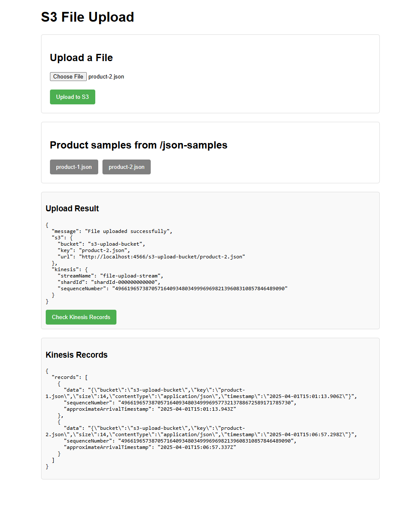

# S3 File Upload with LocalStack and Kinesis Integration

A local development environment demonstrating file uploads to S3 with mock trigger to Kinesis for event streaming using LocalStack.

## Features

- 📁 File upload to LocalStack S3 bucket
- 📨 Real-time event streaming with Kinesis
- 🐳 Dockerized LocalStack setup
- 📊 Web interface for file management
- 🔍 Kinesis record inspection
- 📦 Pre-configured AWS resources initialization
- 🧪 Sample JSON data handling

## Prerequisites

- Docker & Docker Compose
- Node.js 16+
- AWS CLI (optional)
## UI

